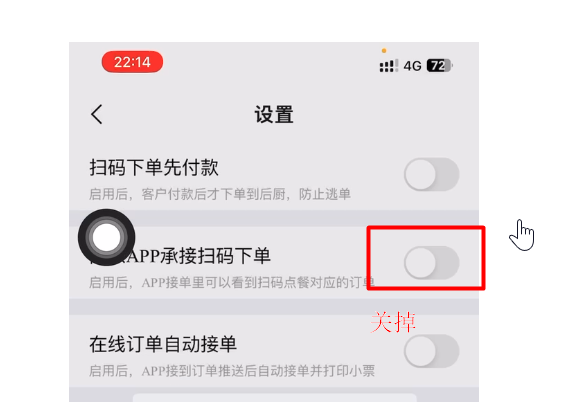
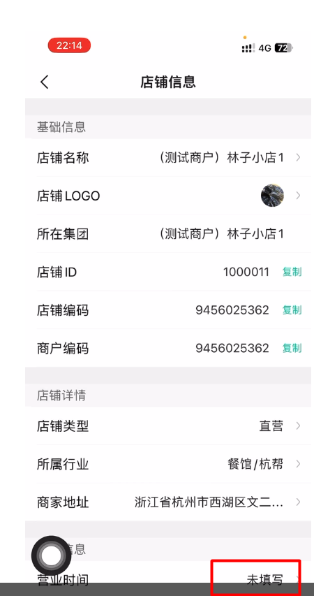

### 长时间没接单

#### 张云：

@권지용 我看了下你们的接单时间滞后很多呢

19.58的单，都1个小时了为什么才接呀

#### 권지용

自动接单都打开了呀

#### 廖水珠

这个 一般是 订单接单超时了  你这边 把订单号发出来  让我们的后台开发的老师 手工处理一下 

现在 新进来的单子 能接成功吗 

#### 권지용

这个不是自动接单打开就不用再去手动接到了吗

#### 廖水珠

是的  一般 打开 都会自动接掉处理，如果 在用户下单时的瞬间，收银机 没开机，网络不好，重启等因素没处理的话 订单就会超时了 

#### 권지용
可能是店里的网络不好

#### 廖水珠

这个超时 参数可以改的  好哦  我通知 后端老师 改一下  

把要改的门店 帐号都 发一下  

### 修改营业时间

#### 廖水珠

对了  每个门店根据自己的情况 把营业时间也配上，不改的话 默认是 24小时营业的，顾客可以扫码进入点餐下单的 ，而门店又是打烊的话 就会引起误会了  

### 接单失败

#### 권지용

渝老七万州烤鱼接单失败帮忙弄一下

#### 王倩

APP上的自动接单关闭了吗
> 关了，这个所有商户都没有开过的

@橄榄枝 麻烦老师看下，他们好像有一单昨天的一直提示接单失败

#### 橄榄枝

@黄建雷8580085 老板您是那家店呢？
> 就是万州烤鱼，我在他这店里

