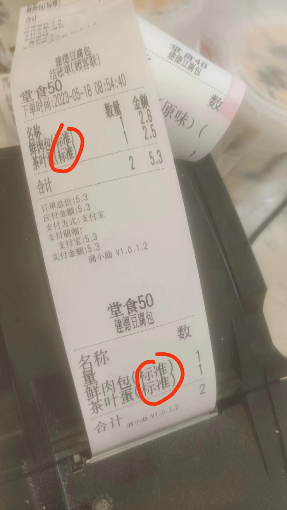
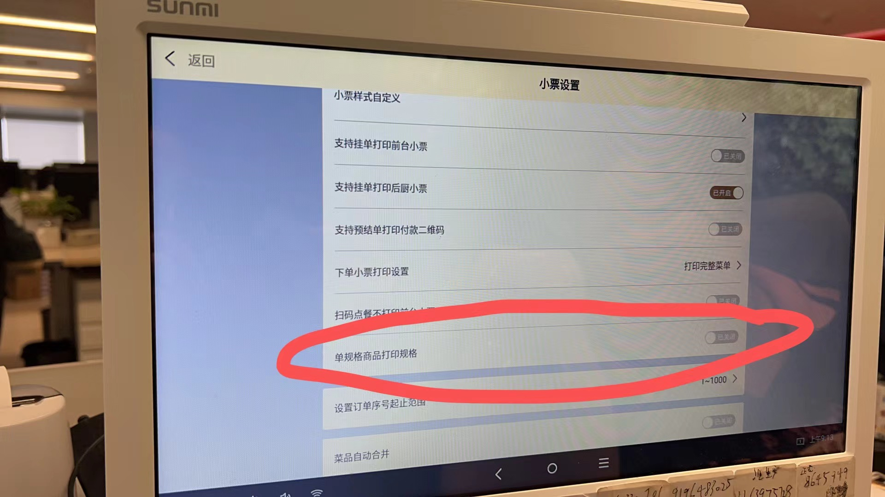
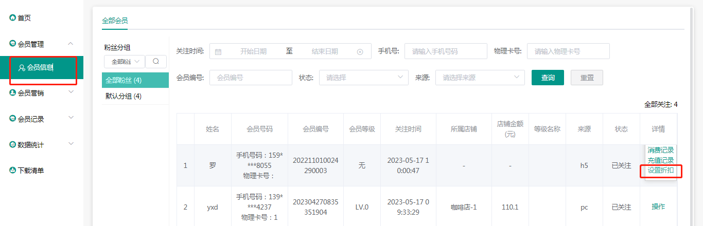
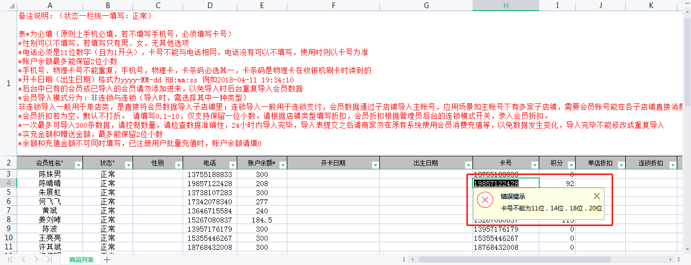

### 这种规格是默认的，怎么也打出来了

 这个关了同步下数据，在下一单试试。商品规格就不会出来了。

###  会员消费可以收到短信通知的吧，短信收费吗

可以的，电子会员，现在还没有收费通知

### 会员都打5折在那里设置

会员卡注册页面可以设置

### 导的会员在那里设置

商家后台（登录店铺账号）

### 可以帮我看下是什么原因吗？导不进去啊

卡号没有的话 为空哈，如果有物理卡 才输入进去

